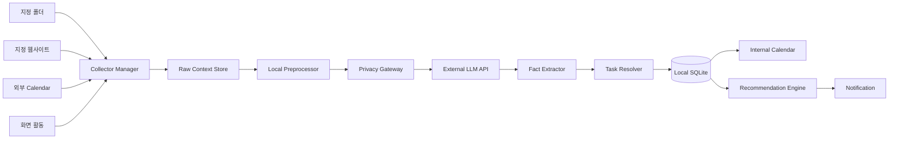
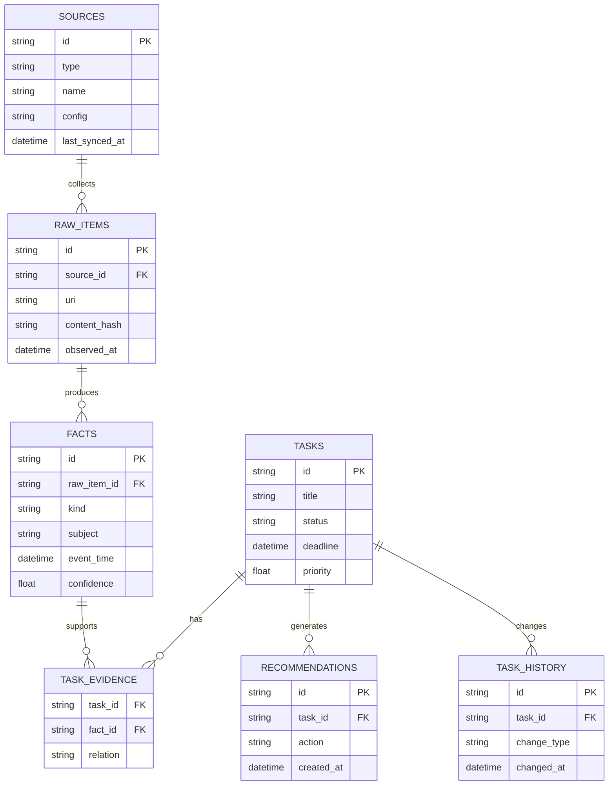

# [프로젝트명] (`dododo`)

> KAIST 몰입캠프 공통과제 III — Option 1. Build the Core (3인 1팀)

**한 줄 소개:** [프로젝트를 한 문장으로 설명합니다.]

**슬로건:** [프로젝트의 핵심 가치를 짧게 작성합니다.]

---

## 팀원

| 이름 | GitHub | 역할 |
|---|---|---|
| 김도연(팀장) | [doyeonid](https://github.com/doyeonid) | Data Ingestion & Local Storage |
| 김도현 | [GitHub ID](https://github.com/) | Context Intelligence & Recommendation |
| 박도현 | [dotori235](https://github.com/dotori235) | Desktop Platform & Activity Runtime |

---

## 프로젝트 소개

### 기획 배경

[사용자가 해결하려는 문제와 프로젝트를 시작하게 된 배경을 작성합니다.]

### 핵심 문제

> [일주일 동안 깊게 해결하고 검증할 기술적 질문을 작성합니다.]

예시:

> 서로 다른 출처에서 반복·충돌·변경되는 개인 정보를 어떻게 하나의 최신 Task Context로 통합할 수 있는가?

### 프로젝트 목표

- [ ] [목표 1]
- [ ] [목표 2]
- [ ] [목표 3]

### 프로젝트 범위 밖

- [이번 MVP에서 의도적으로 구현하지 않는 기능]
- [자동 이메일 전송, 파일 수정 등 사용자를 대신한 외부 행동]
- [지원하지 않는 운영체제 또는 데이터 형식]

### 주요 기능

- **로컬 파일 수집** — [지정 폴더와 지원 파일 형식]
- **웹사이트 수집** — [등록한 공지 사이트의 새 게시물 및 변경 감지]
- **캘린더 연동** — [ICS 또는 외부 캘린더 일정 수집]
- **화면 활동 분석** — [선택한 화면의 현재 작업 Context 추출]
- **Task Context 통합** — [여러 출처의 할 일·마감·요구사항 병합]
- **추천 및 알림** — [현재 상황과 우선순위를 고려한 다음 행동 추천]
- **근거 확인** — [Task와 추천을 생성한 원본 출처 표시]

### 스크린샷 / 데모

> 구현 후 주요 화면과 데모 GIF 또는 영상을 추가합니다.

| Today | Calendar | Sources | Context Evidence |
|---|---|---|---|
| [이미지] | [이미지] | [이미지] | [이미지] |

---

## 핵심 시나리오

1. 사용자가 [과제 폴더]를 등록한다.
2. 사용자가 [학교 공지 URL]과 [캘린더]를 등록한다.
3. 프로그램이 문서와 공지에서 같은 과제의 할 일과 마감을 추출한다.
4. 여러 출처의 정보를 하나의 Task로 병합한다.
5. 수정 공지를 발견하면 기존 Task의 마감과 요구사항을 갱신한다.
6. 현재 화면에서 사용자의 작업을 파악한다.
7. 현재 일정·마감·진행 상태를 반영한 다음 행동을 추천한다.
8. 사용자는 추천에 사용된 모든 원본 근거를 확인할 수 있다.

---

## 시스템 아키텍처



### 데이터 처리 흐름

```txt
RawItem
  → Fact
  → Task
  → Current Context
  → Recommendation
```

### 로컬·외부 경계

| 처리 항목 | 로컬 처리 | 외부 LLM 전송 |
|---|:---:|:---:|
| 원본 파일 저장 | O | X |
| 파일 변경 감지 | O | X |
| 웹사이트 변경 감지 | O | X |
| Task·마감 후보 Chunk | O | 필요 시 |
| 화면 원본 이미지 | 임시 | [정책 작성] |
| 구조화된 Fact·Task | O | X |
| 우선순위 계산 | O | X |

---

## 기술 스택

### Desktop

| 기술 | 용도 |
|---|---|
| [Electron / Tauri] | Windows·macOS 데스크톱 런타임 |
| [React / 기타] | 최소 UI 및 내부 캘린더 |
| [패키징 도구] | Windows Installer / macOS App 패키징 |

### Context Engine

| 기술 | 용도 |
|---|---|
| [TypeScript / Python] | Collector 및 Context 처리 |
| [LLM Provider] | Fact 추출·화면 요약·추천 생성 |
| [Schema Validator] | LLM 구조화 출력 검증 |
| [검색·유사도 기술] | 동일 Task 후보 검색 및 병합 |

### Local Storage

| 기술 | 용도 |
|---|---|
| SQLite | RawItem·Fact·Task·Recommendation 저장 |
| [파일 Parser] | PDF·DOCX·Markdown 텍스트 추출 |
| [웹 Parser] | 공지 목록·본문 수집 |
| [Calendar Parser] | ICS 일정 파싱 |

---

## Getting Started

### 요구 환경

- Node.js: `[버전]`
- npm 또는 pnpm: `[버전]`
- Windows: `[지원 버전]`
- macOS: `[지원 버전]`
- 외부 LLM API Key: `[Provider]`

### 설치 및 실행

```bash
# 1. 저장소 복제
git clone [REPOSITORY_URL]
cd dododo

# 2. 의존성 설치
[INSTALL_COMMAND]

# 3. 환경 변수 설정
cp .env.example .env
# [필요한 환경 변수]를 입력한다.

# 4. 개발 모드 실행
[DEV_COMMAND]

# 5. 테스트
[TEST_COMMAND]

# 6. 운영체제별 패키징
[PACKAGE_COMMAND]
```

### 설치 파일

| 운영체제 | 파일 | 상태 |
|---|---|---|
| Windows | `[installer.exe 또는 .msi]` | [ ] |
| macOS | `[app 또는 .dmg]` | [ ] |

---

## 기획안

- **주제:** [프로젝트명]
- **목적:** [해결하려는 문제]
- **예상 사용자:** [대상 사용자]
- **사용 환경:** Windows / macOS 로컬 데스크톱
- **핵심 가치:** [개인 Context 통합 / 다음 행동 추천 / 개인정보 최소 전송 등]

### 핵심 가설

> [이 프로젝트에서 실험할 가설을 작성합니다.]

### 검증 방법

- **비교 기준:** [초기 방식 / 단순 LLM 요약 / 제안 방식]
- **데이터셋:** [공지·문서·캘린더 Fixture 수]
- **핵심 지표:** [Task 추출 F1, 병합 정확도 등]
- **실험 조건:** [운영체제, 파일 수, 데이터 출처 수 등]

---

## MVP 기능 명세

### 필수 기능

- [ ] Windows·macOS 설치 및 실행
- [ ] 데이터 소스 설정
    - [ ] 사용자가 지정한 로컬 폴더 등록
    - [ ] 사용자가 지정한 공지 사이트 등록
    - [ ] ICS 캘린더 파일 또는 URL 등록
    - [ ] 관찰할 화면 또는 윈도우 선택
- [ ] 로컬 파일 수집
    - [ ] TXT / Markdown
    - [ ] PDF
    - [ ] DOCX
    - [ ] Hash 기반 변경 감지 및 증분 처리
- [ ] 공지 사이트 수집
    - [ ] 새 게시물 탐지
    - [ ] 수정된 게시물 탐지
    - [ ] 원본 URL과 게시 시각 보존
- [ ] 캘린더 통합
    - [ ] 외부 일정 표시
    - [ ] 추출한 Task 마감 표시
- [ ] 화면 활동 분석
    - [ ] 수동 화면 분석
    - [ ] 자동 분석 시작·중지
    - [ ] 원본 화면 저장 방지
- [ ] Context Engine
    - [ ] 할 일·마감·요구사항 추출
    - [ ] 동일 Task 병합
    - [ ] 충돌하는 정보 처리
    - [ ] Task 상태 및 변경 이력 관리
    - [ ] 모든 Task에 원본 근거 연결
- [ ] 추천 및 알림
    - [ ] 현재 우선순위 계산
    - [ ] 구체적인 다음 행동 추천
    - [ ] 완료 및 미루기
    - [ ] 중복 알림 억제

### 선택 기능

- [ ] Google Calendar OAuth
- [ ] Outlook Calendar OAuth
- [ ] 로그인 필요한 공지 사이트
- [ ] 앱별 화면 관찰 Allowlist
- [ ] 로컬 OCR
- [ ] 백그라운드 자동 실행
- [ ] 로컬 DB 암호화
- [ ] 자연어 Context 검색

### 범위 제외

- [ ] 이메일·메신저 자동 수집
- [ ] 파일 자동 수정
- [ ] 이메일 자동 전송
- [ ] 외부 캘린더 자동 변경
- [ ] 키보드 입력 수집
- [ ] 실시간 영상 전체 분석
- [ ] 로컬 LLM 실행

---

## 데이터 소스 명세

| Source | 입력 | 변경 감지 | 추출 결과 | MVP |
|---|---|---|---|:---:|
| File | 지정 폴더 | 파일 Hash·수정 시각 | 문서 Chunk | [ ] |
| Website | URL·CSS Selector | 게시물 Hash | 공지 본문·첨부 | [ ] |
| Calendar | ICS 파일·URL | Event UID·수정 시각 | 일정·회의 | [ ] |
| Screen | 선택한 화면·윈도우 | 주기·화면 변화 | 현재 활동 요약 | [ ] |

---

## Context 데이터 모델



---

## 개인정보 및 보안 정책

- [ ] 사용자가 직접 허용한 폴더만 접근한다.
- [ ] 사용자가 직접 등록한 사이트만 수집한다.
- [ ] 화면 관찰 상태를 항상 확인할 수 있다.
- [ ] 화면 관찰을 즉시 중단할 수 있다.
- [ ] 원본 스크린샷은 로컬 디스크에 저장하지 않는다.
- [ ] 외부 LLM에는 필요한 최소 Context만 전송한다.
- [ ] API Key와 민감정보를 로그에 기록하지 않는다.
- [ ] 외부로 전송한 데이터의 범위와 목적을 확인할 수 있다.
- [ ] 로컬 Context 데이터 전체 삭제 기능을 제공한다.

---

## 평가 계획 및 결과

### 데이터셋

| 종류 | 개수 | 설명 |
|---|---:|---|
| 학교 공지 | [TBD] | [정상 공지·마감 변경·취소 공지 등] |
| 로컬 문서 | [TBD] | [PDF·Markdown·DOCX] |
| 캘린더 일정 | [TBD] | [회의·수업·개인 일정] |
| 화면 Fixture | [TBD] | [코딩·문서 작성·브라우징 등] |

### 핵심 지표

| 지표 | 초기값 | 목표 | 최종 결과 |
|---|---:|---:|---:|
| Task 추출 Precision | [TBD] | [TBD] | [TBD] |
| Task 추출 Recall | [TBD] | [TBD] | [TBD] |
| 마감일 정확도 | [TBD] | [TBD] | [TBD] |
| 동일 Task 병합 정확도 | [TBD] | [TBD] | [TBD] |
| 변경 감지 후 반영 시간 | [TBD] | [TBD] | [TBD] |
| 잘못된 추천 비율 | [TBD] | [TBD] | [TBD] |

### 비교 실험

| 방식 | 설명 | 결과 |
|---|---|---|
| Baseline | [각 문서를 독립적으로 요약] | [TBD] |
| Proposed | [다중 출처 Context 통합 및 상태 갱신] | [TBD] |

### 실패한 시도와 발견

- [실패한 접근 또는 예상과 달랐던 결과]
- [실패 원인]
- [변경한 방법]
- [발견한 내용]

---

## 프로젝트 구조

```txt
dododo/
├── apps/
│   └── desktop/              # Electron/Tauri 데스크톱 앱
├── packages/
│   ├── shared/               # 공통 Schema와 타입
│   ├── collectors/           # File, Website, Calendar, Screen
│   ├── context-engine/       # Fact 추출, Task 병합, 추천
│   ├── storage/              # SQLite, Migration
│   ├── privacy/              # 외부 LLM 전송 정책
│   └── evaluation/           # Fixture, Benchmark
├── docs/                     # 설계·실험 문서
├── fixtures/                 # 평가용 입력 데이터
├── tests/                    # 단위·통합 테스트
└── README.md
```

---

## 일주일 작업 계획

| 일차 | 목표 | 완료 조건 |
|---|---|---|
| 1일차 | 프로젝트 구조·공통 Schema·양 OS 패키징 | Windows/macOS에서 빈 앱 실행 |
| 2일차 | File·Website·Calendar Collector | 세 Source가 RawItem 생성 |
| 3일차 | Fact 추출·SQLite 저장 | 문서에서 Task·마감 저장 |
| 4일차 | Task 병합·충돌 처리·내부 캘린더 | 여러 출처가 하나의 Task로 통합 |
| 5일차 | 화면 분석·추천·알림 | 현재 작업과 관련된 추천 생성 |
| 6일차 | 개인정보·평가·통합 테스트 | Benchmark 및 양 OS 테스트 통과 |
| 7일차 | 패키징·데모·문서화 | 설치 파일과 실험 결과 완성 |

---

## 팀원별 참여 내용

### [팀원 1]

- **담당:** Desktop Platform / Activity Runtime
- **주요 구현:** [작성]
- **실험 및 문제 해결:** [작성]

### [팀원 2]

- **담당:** Data Ingestion / Local Storage
- **주요 구현:** [작성]
- **실험 및 문제 해결:** [작성]

### [팀원 3]

- **담당:** Context Intelligence / Recommendation
- **주요 구현:** [작성]
- **실험 및 문제 해결:** [작성]

### 협업 과정

- [공통 Schema와 인터페이스 결정 과정]
- [매일 통합 및 코드 리뷰 방식]
- [공동으로 해결한 핵심 문제]

---

## 배포 결과물

- **GitHub:** [REPOSITORY_URL]
- **Windows 설치 파일:** [URL]
- **macOS 설치 파일:** [URL]
- **데모 영상:** [URL]
- **실행 방법:** [Getting Started](#getting-started) 참고

---

## 회고

### Keep

- [계속 유지하고 싶은 점]

### Problem

- [문제가 되었던 점]

### Try

- [다음에 시도하거나 개선할 점]

---

## 참고 자료

- [프로젝트 기획 문서](docs/)
- [시스템 아키텍처 문서](docs/architecture.md)
- [데이터 모델 문서](docs/data-model.md)
- [실험 및 평가 결과](docs/evaluation.md)
