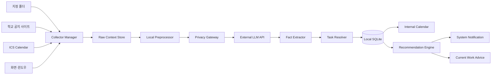
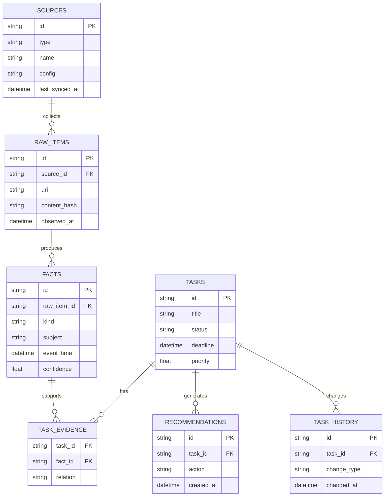

# Context Assistant (`dododo`)

> KAIST 몰입캠프 공통과제 III — Option 1. Build the Core (3인 1팀)

**한 줄 소개:** 학교 사이트·학교 이메일·LMS·파일·캘린더·화면 활동을 로컬 Context로 통합하고, 근거와 함께 다음 행동을 추천하는 대학생용 AI 비서.

> 현재 단계는 핵심 파이프라인을 검증하는 Node.js 기반 CLI MVP다. GUI 데스크톱 앱과 설치 패키지는 이후 단계에서 같은 Core를 재사용해 구현한다.

**슬로건:** 흩어진 정보를, 하나의 최신 Task Context로.

---

## 팀원

| 이름 | GitHub | 역할 |
|---|---|---|
| 김도연(팀장) | [doyeonid](https://github.com/doyeonid) | Data Ingestion & Local Storage |
| 김도현 | [GitHub ID](https://github.com/) | Context Intelligence & Recommendation |
| 박도현 | [dotori235](https://github.com/dotori235) | Runtime & CLI |

---

## 프로젝트 소개

### 기획 배경

과제 공지는 학교 홈페이지에, 세부 요구사항은 과제 PDF에, 팀 회의 일정은 캘린더에, 실제 진행 상황은 사용자가 지금 보고 있는 화면에 흩어져 있다. 각 출처는 그 자체로는 정보가 있지만, 사람이 매번 이를 종합해 "지금 뭘 해야 하는지"를 다시 계산해야 한다. 이 프로젝트는 "모든 것을 아는 AI 비서"를 만드는 대신, 사용자가 직접 지정한 네 가지 출처(폴더, 공지 사이트, ICS 캘린더, 화면)를 하나의 로컬 Task Context로 통합하고, 근거 있는 추천을 제공하는 것을 목표로 한다.

### 핵심 문제

> 서로 다른 출처에서 반복·충돌·변경되는 개인 정보를 어떻게 하나의 최신 Task Context로 통합할 수 있는가?

### 프로젝트 목표

- [ ] 지정 폴더·공지 사이트·ICS 캘린더·화면 활동에서 할 일·마감·요구사항을 자동 추출한다.
- [ ] 서로 다른 출처의 정보가 같은 작업을 가리킬 때 하나의 Task로 병합한다.
- [ ] 마감·현재 활동·일정을 반영해 근거가 표시된 추천과 알림을 제공한다.

### 프로젝트 범위 밖

- Gmail·Slack·Notion 등 로그인이 필요한 서비스 연동
- 파일 자동 수정, 이메일 자동 전송, 일정 자동 변경 등 사용자를 대신한 외부 행동
- 실시간 영상 분석, 키보드 입력 수집, 로컬 LLM 실행, 완전한 개인정보 암호화 시스템

### 주요 기능

- **로컬 파일 수집** — 사용자가 지정한 폴더의 TXT·Markdown·PDF(선택 시 DOCX)를 감시하고 변경분만 재분석
- **웹사이트 수집** — 등록한 학교 공지 사이트에서 새 게시물·수정 게시물을 감지하고 첨부 PDF까지 수집
- **캘린더 연동** — ICS 파일 또는 구독 URL을 파싱해 외부 일정과 추출된 마감을 통합 표시
- **화면 활동 분석** — 사용자가 선택한 화면/윈도우를 수동 또는 3~5분 간격 자동으로 분석해 현재 작업을 요약(원본 스크린샷은 저장하지 않음)
- **Task Context 통합** — 여러 출처의 할 일·마감·요구사항을 의미 유사도 기반으로 병합하고 충돌을 우선순위 규칙으로 해결
- **추천 및 알림** — 마감 긴급도·회의 시간·미완료 요구사항·현재 작업 관련도를 계산해 다음 행동을 추천하고 시스템 알림으로 전달
- **근거 확인** — 모든 Task와 추천에 원본 출처(파일 경로, 게시물 URL, 캘린더 이벤트, 화면 요약)를 연결해 표시

### 스크린샷 / 데모

> 구현 후 주요 화면과 데모 GIF 또는 영상을 추가합니다.

| Today | Calendar | Sources | Context Evidence |
|---|---|---|---|
| [이미지] | [이미지] | [이미지] | [이미지] |

---

## 핵심 시나리오

1. 사용자가 과제 폴더, 학교 공지 URL(+ CSS Selector), ICS 캘린더를 등록한다.
2. 프로그램이 폴더·사이트·캘린더를 주기적으로 동기화해 RawItem을 생성한다.
3. LLM이 문서와 공지에서 할 일·마감·요구사항을 Fact로 추출한다.
4. 의미 유사도·과목/프로젝트 일치·마감 근접성 등으로 점수를 계산해 동일 작업을 하나의 Task로 병합한다.
5. 수정된 공지를 발견하면 최신 공식 공지를 최우선으로 기존 Task의 마감·요구사항을 갱신하고 변경 이력을 남긴다.
6. 사용자가 관찰 중인 화면(예: README 작성 중)에서 현재 활동을 요약해 관련 Task와 연결한다.
7. 코드가 우선순위 후보를 계산하고, LLM이 이를 회의 시간·미완료 요구사항을 반영한 구체적인 다음 행동 문장으로 변환한다.
8. 마감이 가까워지면 알림을 보내되, 동일 알림은 30분 내 반복하지 않고 사용자가 미루면 지정 시간까지 억제한다.
9. 사용자는 모든 Task와 추천에 연결된 원본 근거(파일 경로, 공지 URL, 캘린더 이벤트, 화면 요약)를 확인할 수 있다.

---

## 시스템 아키텍처



### 데이터 처리 흐름

```txt
RawItem
  → Fact
  → Task
  → Current Context
  → Recommendation
```

### 프로세스 구성

**Main Process**
- 파일 감시, 사이트 동기화 스케줄, 화면 캡처, 시스템 알림, SQLite 접근, 외부 LLM 호출, 백그라운드 동작

**Renderer Process** (최소 UI)
- 오늘 해야 할 일, 내부 캘린더, 데이터 소스 설정, 추천 근거, 화면 관찰 일시정지, 개인정보 설정

### 로컬·외부 경계

| 처리 항목 | 로컬 처리 | 외부 LLM 전송 |
|---|:---:|:---:|
| 원본 파일 저장 | O | X |
| 파일 변경 감지 | O | X |
| 웹사이트 변경 감지 | O | X |
| Task·마감 후보 Chunk | O | 필요 시 최소 단위만 |
| 화면 원본 이미지 | 임시(즉시 삭제) | X (요약 텍스트만 전송) |
| 구조화된 Fact·Task | O | X |
| 우선순위 계산 | O | X |

---

## 기술 스택

### CLI Runtime

| 기술 | 용도 |
|---|---|
| Node.js 22.18 이상 | TypeScript 직접 실행과 CLI Runtime |
| TypeScript | CLI·Collector·Context Engine 공통 언어 |
| Node Test Runner | 외부 의존성 없는 기본 Smoke Test |

### Context Engine

| 기술 | 용도 |
|---|---|
| TypeScript | Collector 및 Context 처리 |
| LLM Provider (1개) | Fact 추출·화면 요약·추천 문장 생성 |
| JSON Schema Validator | LLM 구조화 출력 검증 |
| 의미 유사도 계산 | 동일 Task 후보 검색 및 병합 점수 산정 |

### Local Storage

| 기술 | 용도 |
|---|---|
| SQLite | RawItem·Fact·Task·Recommendation 저장 |
| PDF/DOCX/Markdown Parser | 로컬 문서 텍스트 추출(페이지 번호 보존) |
| 웹 Parser + CSS Selector | 공지 목록·본문 수집 |
| ICS Parser | 캘린더 일정 파싱 |

---

## Getting Started

### 요구 환경

- Node.js: `22.18 이상`
- npm: Node.js에 포함된 버전
- Windows 또는 macOS
- 팀 Gateway를 사용할 경우 운영진이 발급한 일회용 설치 코드
- 로컬 Ollama를 직접 사용할 경우에만 별도 Ollama와 모델 설치

### 제3자 설치 및 원격 LLM 연결

```bash
# 1. 저장소 복제
git clone https://github.com/madcamp-official/dododo.git
cd dododo

# 2. 의존성 설치
npm ci

# 3. 프로필 설정과 설치 코드 활성화
# 운영진에게 받은 일회용 설치 코드를 질문에 입력한다.
npm start -- setup

# 4. 공개 Gateway와 실제 인증 추론 확인
npm start -- doctor --llm-test

# 5. Fixture 기반 첫 사용
npm start -- sync
npm start -- inbox
npm start -- today
npm start -- ask "운영체제"
```

`setup`은 기본적으로 `https://llm.madcamp-kaist.org`에서 설치 코드를 기기별 Token으로
교환하고, Token을 Git에서 제외되는 `.env`에 권한 `0600`으로 저장한다. Token 원문은
콘솔이나 Git에 남기지 않는다.

> 원격 Gateway를 사용할 사람은 먼저 `cp .env.example .env`를 실행할 필요가 없다.
> `.env.example`의 기본값은 로컬 Ollama를 직접 운영하는 개발자를 위한 예시다.

`dododo.sources.json`을 만들지 않은 첫 실행은 학교 사이트·학교 이메일·LMS Fixture로
동작한다. 실제 Source를 쓰려면 학교 사이트 URL과 Selector, 이메일 `.eml` 디렉터리,
LMS HTML 경로를 `dododo.sources.json`에 별도로 설정해야 한다. 계정 자동 로그인이나
OAuth 연동은 현재 MVP 범위에 포함되지 않는다.

### 운영자: 사용자별 설치 코드 발급

Gateway VM의 `/opt/dododo`에서 사용자마다 코드를 하나씩 발급한다. 코드는 기본 7일 후
만료되며 한 번 활성화하면 다시 사용할 수 없다. 발급 명령은 코드 Hash만 Gateway SQLite에
저장하고 원문은 명령 실행 직후 한 번만 출력한다. 서비스 재시작은 필요하지 않다.

```bash
cd /opt/dododo

# 사용자별 코드 발급·등록
sudo GATEWAY_DB_PATH=/var/lib/dododo/gateway.db \
  npm run gateway:activation-code -- issue \
  --label "홍길동 MacBook" \
  --expires-days 7

# 발급 상태 확인(원문은 표시하지 않음)
sudo GATEWAY_DB_PATH=/var/lib/dododo/gateway.db \
  npm run gateway:activation-code -- list

# 아직 사용하지 않은 코드 취소
sudo GATEWAY_DB_PATH=/var/lib/dododo/gateway.db \
  npm run gateway:activation-code -- revoke --id ac_발급된_ID
```

기존 `GATEWAY_ACTIVATION_CODES` 환경변수 방식도 호환을 위해 유지하지만, 신규 사용자는
위 DB 기반 명령으로 발급한다. 설치 코드와 기기 Token을 README, 이슈, PR 또는 Git에
커밋하지 않는다.

### 설치 파일

| 운영체제 | 파일 | 상태 |
|---|---|---|
| Windows | `[installer.exe 또는 .msi]` | [ ] |
| macOS | `[app 또는 .dmg]` | [ ] |

> 공개 배포용 코드 서명은 확장 범위로 두고, MVP는 테스트 기기에 직접 설치해 검증한다.

---

## 기획안

- **주제:** Context Assistant — Local-first 개인 Task Context 통합 비서
- **목적:** 여러 출처에서 계속 변하는 개인 정보를 최신의 일관된 Task Context로 유지하고, 근거 있는 추천을 제공한다.
- **예상 사용자:** 여러 과제·공지·일정·작업 화면을 동시에 관리해야 하는 학생 및 팀 프로젝트 참여자
- **사용 환경:** Windows / macOS 로컬 데스크톱
- **핵심 가치:** 개인 Context 통합 / 근거 기반 다음 행동 추천 / 개인정보 최소 전송

### 핵심 가설

> 코드가 우선순위 후보와 병합 점수를 먼저 계산하고 LLM이 최종 판단과 자연어 조언만 담당하면, LLM 단독 처리보다 더 정확하고 설명 가능한 Task 통합이 가능하다.

### 검증 방법

- **비교 기준:** 각 문서를 독립적으로 요약하는 방식(Baseline) vs. 다중 출처 Context 통합 및 상태 갱신 방식(Proposed)
- **데이터셋:** 실제 학교 공지·과제 PDF 30~50개와 사람이 작성한 Ground Truth
- **핵심 지표:** 할 일·마감 추출 F1, 다중 출처 Task 병합 정확도
- **실험 조건:** Windows/macOS, 폴더 1개 이상, 공지 사이트 1곳 이상, ICS 캘린더 1개 기준

---

## MVP 기능 명세

### 필수 기능

- [ ] Windows·macOS 설치 및 실행
- [ ] 데이터 소스 설정
    - [ ] 사용자가 지정한 로컬 폴더 등록(1개 이상)
    - [ ] 사용자가 지정한 공지 사이트 등록(1곳 이상, CSS Selector 포함)
    - [ ] ICS 캘린더 파일 또는 URL 등록(1개)
    - [ ] 관찰할 화면 또는 윈도우 선택
- [ ] 로컬 파일 수집
    - [ ] TXT / Markdown
    - [ ] PDF
    - [ ] Hash 기반 변경 감지 및 증분 처리
- [ ] 공지 사이트 수집
    - [ ] 새 게시물 탐지
    - [ ] 수정된 게시물 탐지
    - [ ] 원본 URL과 게시 시각 보존
- [ ] 캘린더 통합
    - [ ] 외부 일정 표시
    - [ ] 추출한 Task 마감 표시
- [ ] 화면 활동 분석
    - [ ] 수동 화면 분석("현재 화면 조언받기")
    - [ ] 자동 분석 시작·중지(3~5분 간격)
    - [ ] 원본 화면 저장 방지
- [ ] Context Engine
    - [ ] 할 일·마감·요구사항 추출
    - [ ] 동일 Task 병합(병합 점수 70점 이상 자동, 40~69점 사용자 확인)
    - [ ] 충돌하는 정보 처리(최신 공식 공지 > 지정 공식 문서 > 외부 Calendar > 화면 분석 > LLM 추정)
    - [ ] Task 상태 및 변경 이력 관리
    - [ ] 모든 Task에 원본 근거 연결
- [ ] 추천 및 알림
    - [ ] 현재 우선순위 계산(마감 긴급도, 중요도, 미완료 요구사항, 관련 일정, 현재 작업 관련도)
    - [ ] 구체적인 다음 행동 추천
    - [ ] 완료 및 미루기(Snooze)
    - [ ] 중복 알림 억제(동일 추천 30분 내 반복 금지, 화면 공유/전체 화면 중 억제, 일일 최대 알림 수 제한)

### 선택 기능

- [ ] DOCX 지원
- [ ] 공지 사이트 여러 곳 동시 등록
- [ ] 화면 변경 감지(변화가 클 때만 분석)
- [ ] 자동 화면 분석 상시 활성화
- [ ] 앱별 관찰 Allowlist
- [ ] Google Calendar / Outlook OAuth 연동
- [ ] 백그라운드 자동 시작

### 범위 제외

- [ ] Gmail·Slack·Notion 등 로그인 필요한 서비스 연동
- [ ] 모든 캘린더 자동 연결
- [ ] 모든 파일 형식 지원
- [ ] 실시간 영상 전체 분석
- [ ] 키보드 입력 수집
- [ ] 파일 자동 수정, 이메일 자동 전송, 일정 자동 변경
- [ ] 장기 성격 학습
- [ ] 로컬 LLM 실행
- [ ] 완전한 개인정보 암호화 시스템

---

## 데이터 소스 명세

| Source | 입력 | 변경 감지 | 추출 결과 | MVP |
|---|---|---|---|:---:|
| File | 지정 폴더(TXT·MD·PDF, 선택 시 DOCX) | 파일 Hash·수정 시각 | 문서 Chunk(PDF는 페이지 번호 보존) | [ ] |
| Website | URL·CSS Selector(목록형) 또는 자동 추출(기사형) | 게시물 Hash·Diff | 공지 본문·첨부 PDF | [ ] |
| Calendar | ICS 파일·구독 URL | Event UID·수정 시각 | 일정·회의 | [ ] |
| Screen | 선택한 화면·윈도우 | 수동 또는 3~5분 주기 | 현재 활동 요약(축소 이미지, 원본 즉시 삭제) | [ ] |

---

## Context 데이터 모델



### 공통 TypeScript 타입 (요약)

```ts
type RawItem = {
  id: string;
  sourceType: "file" | "website" | "calendar" | "screen";
  sourceUri: string;
  title?: string;
  content: string;
  contentHash: string;
  observedAt: string;
  metadata: Record<string, unknown>;
};

type Fact = {
  id: string;
  rawItemId: string;
  kind: "task" | "deadline" | "meeting" | "requirement" | "status";
  subject: string;
  value: string;
  eventTime?: string;
  confidence: number;
  evidenceText: string;
};

type Task = {
  id: string;
  title: string;
  status: "candidate" | "todo" | "in_progress" | "done" | "cancelled";
  deadline?: string;
  requirements: string[];
  priority: number;
  evidenceIds: string[];
};
```

### 병합 점수 기준

| 항목 | 점수 |
|---|---:|
| 제목·의미 유사도 | 0~40 |
| 같은 과목·프로젝트 | 0~20 |
| 마감일 근접성 | 0~15 |
| 첨부파일 관계 | 0~15 |
| 등장 인물·팀원 | 0~10 |

- 70점 이상: 자동 병합
- 40~69점: 사용자 확인
- 40점 미만: 별도 Task

### 우선순위 계산

```txt
Priority =
  마감 긴급도
  + 중요도
  + 미완료 요구사항
  + 오늘 관련 일정
  + 현재 작업과의 관련도
  - 최근 알림 패널티
  - 사용자 Snooze
```

---

## 개인정보 및 보안 정책

- [ ] 사용자가 직접 허용한 폴더만 접근한다(전체 디스크 접근 금지).
- [ ] 사용자가 직접 등록한 사이트만 수집한다(로그인 필요 사이트 제외).
- [ ] 화면 관찰 상태를 항상 확인할 수 있다.
- [ ] 화면 관찰을 즉시 중단할 수 있다.
- [ ] 원본 스크린샷은 로컬 디스크에 저장하지 않는다(요약 생성 즉시 삭제).
- [ ] 외부 LLM에는 필요한 최소 Context만 전송한다(Privacy Gateway를 통한 Chunk 선택·마스킹).
- [ ] API Key는 OS 보안 저장소에 저장하고, 로그에 원문·API Key를 기록하지 않는다.
- [ ] 외부로 전송한 데이터의 범위와 목적을 확인할 수 있다.
- [ ] 로컬 Context 데이터 전체 삭제 기능을 제공한다.
- [ ] 모든 Task와 추천에 원본 출처를 표시한다.
- [ ] 웹페이지·문서 내용은 LLM에 대한 명령이 아닌 데이터로만 취급한다(Prompt Injection 대응).
- [ ] 앱은 조언만 제공하며 파일 수정·이메일 전송 등 외부 행동을 하지 않는다.

---

## 평가 계획 및 결과

### 데이터셋

| 종류 | 개수 | 설명 |
|---|---:|---|
| 학교 공지 | [TBD] | 정상 공지·마감 변경·취소 공지 등 |
| 로컬 문서 | [TBD] | PDF·Markdown(선택 시 DOCX) |
| 캘린더 일정 | [TBD] | 회의·수업·개인 일정 |
| 화면 Fixture | [TBD] | 코딩·문서 작성·브라우징 등 |

### 핵심 지표

| 지표 | 초기값 | 목표 | 최종 결과 |
|---|---:|---:|---:|
| 할 일·마감 추출 F1 | [TBD] | [TBD] | [TBD] |
| 다중 출처 Task 병합 정확도 | [TBD] | [TBD] | [TBD] |
| 변경 감지 후 반영 시간 | [TBD] | [TBD] | [TBD] |
| 잘못된 추천 비율 | [TBD] | [TBD] | [TBD] |
| 중복 알림 비율 | [TBD] | [TBD] | [TBD] |
| 화면 조언 생성 시간 | [TBD] | [TBD] | [TBD] |
| 외부 LLM 전송 데이터 크기 | [TBD] | [TBD] | [TBD] |

### 비교 실험

| 방식 | 설명 | 결과 |
|---|---|---|
| Baseline | 각 문서를 독립적으로 요약(출처 간 병합 없음) | [TBD] |
| Proposed | 다중 출처 Context 통합 및 상태 갱신 | [TBD] |

### 실패한 시도와 발견

- [실패한 접근 또는 예상과 달랐던 결과]
- [실패 원인]
- [변경한 방법]
- [발견한 내용]

---

## 프로젝트 구조

```txt
dododo/
├── apps/
│   └── cli/src/               # CLI 진입점과 명령
├── packages/
│   ├── shared/src/            # 공통 Domain과 계약
│   ├── collectors/src/        # 학교 사이트·이메일·LMS·파일·화면
│   ├── context-engine/src/    # 추출·분류·병합·추천 Pipeline
│   ├── storage/src/           # Repository 구현
│   ├── profile/src/
│   ├── scheduler/src/
│   ├── privacy/src/
│   └── evaluation/src/
├── fixtures/                  # Source별 데모·평가 입력
├── docs/                      # 기획·범위·시나리오·구조
├── tests/
└── package.json
```

세부 모듈 계약은 [시스템 구조](docs/architecture.md), 일별 구현 계획과 경로별 담당은 [MVP 범위](docs/mvp-scope.md)를 참고한다.

---

## 일주일 작업 계획

| 일차 | 목표 | 완료 조건 |
|---|---|---|
| 1일차 | 프로젝트 구조·공통 Schema·양 OS 패키징 | Windows/macOS에서 빈 앱 실행, Fixture PDF → Task |
| 2일차 | File·Website·Calendar Collector | 세 Collector가 RawItem 생성(실제 폴더·공지·ICS) |
| 3일차 | Fact 추출·SQLite 저장 | RawItem → Fact → Task·마감이 구조화되어 저장 |
| 4일차 | Task 병합·충돌 처리·내부 캘린더 | 공지+PDF+일정이 하나의 Task로 통합, 수정 공지 반영 |
| 5일차 | 화면 분석·추천·알림 | 현재 화면 → 관련 Task → 구체적 조언 생성 |
| 6일차 | 개인정보·평가·안정화 | 새 공지 발견 → Task 갱신 → 알림, Benchmark 및 양 OS 통합 테스트 |
| 7일차 | 패키징·데모·문서화 | 설치 파일, README, 실험 결과 완성 |

---

## 팀원별 참여 내용

### 박도현 — Desktop Platform & Activity Runtime

- **담당:** Electron 앱 구조, Main/Renderer IPC, 폴더 선택과 파일 감시, 화면·윈도우 캡처, 캡처 주기와 변경 감지, 시스템 알림, 권한 상태 확인, Windows/macOS 패키징, 앱 시작·종료·백그라운드 처리
- **핵심 산출물:** `captureScreen(): Promise<ScreenSnapshot>`, `watchDirectory(path): AsyncIterable<FileChange>`, `sendNotification(message): Promise<void>`
- **성공 기준:** Windows/macOS 설치 및 실행, 사용자가 선택한 폴더만 감시, 화면 캡처 시작·중지 가능, 원본 화면을 디스크에 남기지 않음
- **주요 구현:** [작성]
- **실험 및 문제 해결:** [작성]

### 김도연 — Data Ingestion & Local Storage

- **담당:** 사이트 Connector, 새 공지·수정 공지 탐지, PDF·DOCX·Markdown Parser, ICS Calendar Connector, SQLite Schema와 Migration, RawItem 저장, Hash 기반 증분 동기화, Scheduler, 출처 및 변경 이력
- **핵심 산출물:** `Collector` 인터페이스(`sync(): Promise<RawItem[]>`) 및 `FileCollector`, `WebsiteCollector`, `CalendarCollector`
- **성공 기준:** 반복 동기화에도 중복 생성 없음, 변경된 데이터만 재처리, 모든 데이터에 원본 URL·파일·일정 ID 존재, Collector 하나가 실패해도 다른 Collector는 계속 동작
- **주요 구현:** [작성]
- **실험 및 문제 해결:** [작성]

### 김도현 — Context Intelligence & Recommendation

- **담당:** LLM Provider Adapter, JSON Schema 기반 Fact 추출, Task·Deadline·Requirement 추출, 동일 Task 병합, 충돌 해결, 화면 활동과 Task 연결, 우선순위 계산, 조언 생성, 근거 설명, 평가 데이터셋과 Benchmark
- **핵심 산출물:** `extractFacts(raw: RawItem): Promise<Fact[]>`, `resolveTasks(facts: Fact[]): Promise<Task[]>`, `recommend(context: CurrentContext): Promise<Recommendation[]>`
- **성공 기준:** 모든 추천에 근거 존재, 동일 과제가 여러 출처에 있어도 하나로 병합, 최신 공지로 기존 마감 갱신, 화면과 관련된 Task를 찾아 구체적인 다음 행동 제안
- **주요 구현:** [작성]
- **실험 및 문제 해결:** [작성]

### 협업 과정

- 공통 TypeScript Schema(RawItem, Fact, Task, Recommendation)를 첫날 고정하고, 각자 Fixture JSON으로 병렬 개발
- 매일 하나의 수직 기능(예: PDF → Task → 캘린더 → 알림)을 끝까지 연결해 통합
- 개인정보 정책, SQLite 핵심 테이블, 내부 캘린더 최소 UI, 통합 테스트는 공동 작업

---

## 배포 결과물

- **GitHub:** [REPOSITORY_URL]
- **Windows 설치 파일:** [URL]
- **macOS 설치 파일:** [URL]
- **데모 영상:** [URL]
- **실행 방법:** [Getting Started](#getting-started) 참고

---

## 회고

### Keep

- [계속 유지하고 싶은 점]

### Problem

- [문제가 되었던 점]

### Try

- [다음에 시도하거나 개선할 점]

---

## 참고 자료

- [프로젝트 기획안](docs/product-plan.md)
- [MVP 범위](docs/mvp-scope.md)
- [대표 사용 시나리오](docs/user-scenarios.md)
- [시스템 구조](docs/architecture.md)
