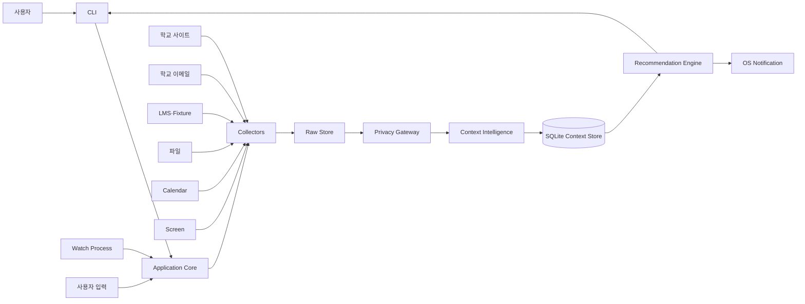
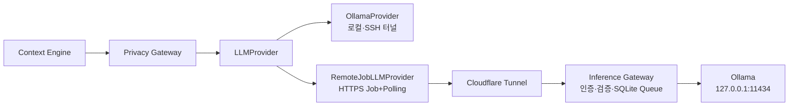

# 시스템 구조

## 1. 구조 원칙

- CLI는 사용자 입출력만 담당한다.
- 수집기, Context Engine, 저장소는 CLI와 독립적으로 실행할 수 있어야 한다.
- `watch` 프로세스와 단발성 CLI 명령은 같은 코어 모듈을 사용한다.
- 로컬·외부 여부와 관계없이 LLM Provider 호출 전에는 Privacy Gateway를 통과한다.
- 각 단계의 입력과 출력을 로컬에 기록해 문제를 추적할 수 있게 한다.
- 수집기 하나가 실패해도 다른 수집기와 CLI 조회는 계속 작동한다.

## 2. 상위 구조



LLM Provider는 같은 `LLMProvider.completeJSON()` 계약 아래 두 배치 방식을 지원한다.



Inference Gateway는 `127.0.0.1:18080`에만 바인딩한다. 공개 HTTPS 주소는 Cloudflare
Tunnel이 Gateway에 연결하며, Ollama API는 직접 공개하지 않는다. Gateway는 실제 모델명을
서버 설정으로 선택하고 클라이언트에는 `text`/`vision` 종류만 허용한다.

## 3. 런타임 구성

### 단발성 CLI

명령을 실행하고 결과를 출력한 뒤 종료한다.

```text
dododo sync
dododo today
dododo inbox
dododo ask "오늘 뭘 먼저 해야 해?"
```

원격 Gateway를 처음 사용하는 기기는 `setup`에서 운영진이 발급한 일회용 설치 코드를
입력한다. CLI는 `/v1/auth/activate`로 기기 Token을 발급받아 Git에서 제외되는 `.env`에
권한 `0600`으로 저장한다. Token 원문은 화면이나 로그에 출력하지 않는다.

```text
npm start -- setup
→ 설치 코드 입력
→ 기기 Token 발급·.env 저장
→ npm start -- doctor --llm-test
→ 인증된 실제 추론 Job 검증
```

일반 `doctor`는 비용 없는 공개 `/health`만 확인한다. `--llm-test`를 명시한 경우에만
일일 사용량을 1회 소비하는 실제 인증 Job을 생성한다.

### Watch Process

사용자가 실행해 둔 동안 다음을 반복한다.

```text
수집 스케줄 확인
→ 변경된 Source만 동기화
→ 새로운 RawItem 분석
→ Context 갱신
→ 알림 후보 계산
→ 정책을 통과한 알림 전송
```

Watch Process가 종료되면 자동 수집과 알림도 멈춘다. OS 서비스 등록은 MVP 이후 범위다.

## 4. 처리 파이프라인

```text
Source
→ RawItem
→ Fact
→ ContextItem
→ Relation / Evidence
→ Recommendation Candidate
→ Policy Filter
→ CLI 또는 Notification
```

### 수집

Collector는 원문과 출처 메타데이터를 RawItem으로 만든다. 이 단계에서는 공지가 사용자에게 필요한지 판단하지 않는다.

### 변경 감지

URL, 이메일 Message-ID, LMS 항목 ID, 캘린더 UID, 파일 경로와 Content Hash를 이용해 신규·수정·중복을 구분한다. 학교 사이트·이메일·LMS가 같은 내용을 전달하면 출처는 여러 개로 보존하되 ContextItem은 하나로 병합한다.

### 정보 추출

LLM 또는 Parser가 제목, 날짜, 지원 자격, 요구사항과 근거 문장을 Fact로 추출한다. 출력 형식이 검증되지 않으면 저장하지 않는다.

### 분류

Fact의 성격과 출처를 이용해 Opportunity, Task, Event, Note, Activity를 만든다.

### 병합과 충돌 해결

기존 ContextItem과 같은 대상인지 확인한다. 같은 대상이면 새 항목을 만들지 않고 변경 이력과 Evidence를 추가한다.

### 추천

일반 코드가 후보와 점수를 계산하고, LLM은 필요할 때 설명과 문장을 생성한다.

## 5. 현재 저장소 구조

```text
dododo/
├── apps/
│   ├── inference-gateway/       # 인증·비동기 Job API·Ollama Queue
│   └── cli/
│       └── src/
│           ├── commands/         # 명령 카탈로그, help, doctor
│           └── index.ts          # CLI 진입점
├── packages/
│   ├── shared/
│   │   └── src/                  # 공통 Domain과 인터페이스
│   ├── collectors/
│   │   └── src/
│   │       ├── school-site/
│   │       ├── school-email/
│   │       ├── lms/
│   │       ├── files/
│   │       ├── calendar/
│   │       └── screen/
│   ├── context-engine/
│   │   └── src/
│   │       ├── extraction/
│   │       ├── classification/
│   │       ├── resolution/
│   │       ├── recommendation/
│   │       └── pipeline.ts
│   ├── storage/src/              # In-memory 구현, SQLite 예정
│   ├── profile/src/
│   ├── scheduler/src/
│   ├── privacy/src/
│   └── evaluation/src/
├── fixtures/                     # Source별 데모·평가 입력
│   ├── school-site/
│   ├── school-email/
│   ├── lms/
│   └── screen/
├── docs/
├── tests/
├── package.json
└── .env.example
```

## 6. 모듈 계약

| 생산자 | 계약 | 소비자 |
|---|---|---|
| Collector | `sync(): Promise<RawItem[]>` | Context Pipeline |
| Privacy Gateway | `prepare(rawItem): Promise<RawItem>` | Fact Extractor |
| Fact Extractor | `extract(rawItem): Promise<Fact[]>` | Context Resolver |
| Context Resolver | `resolve(facts, existing): Promise<ContextItem[]>` | Repository |
| Repository | 저장·조회 인터페이스 | CLI, Pipeline, Recommender |
| Recommendation Engine | `recommend(items, profile, now)` | CLI, Scheduler |

모든 모듈은 `packages/shared/src`의 계약만 공유한다. Collector가 SQLite에 직접 쓰거나 CLI가 LLM Provider를 직접 호출하지 않는다.

### 원격 추론 API 계약

| Endpoint | 인증 | 역할 |
|---|---|---|
| `GET /health` | 없음 | Tunnel과 프로세스 생존 확인 |
| `POST /v1/auth/activate` | 일회용 설치 코드 | 기기별 Bearer Token을 한 번 발급 |
| `POST /v1/inference/jobs` | Bearer Token | 검증된 비동기 추론 Job 생성 |
| `GET /v1/inference/jobs/:id` | Bearer Token | 자기 Job 상태와 결과 조회 |
| `DELETE /v1/inference/jobs/:id` | Bearer Token | 대기·실행 Job 취소 표시 |

Job 상태는 `queued → running → succeeded|failed`이며 사용자 취소 시 `cancelled`가 된다.
Job의 입력은 성공·실패·취소 시 SQLite에서 제거하고 결과·오류는 TTL 이후 삭제한다. 서버
재시작 때 `running` Job은 `queued`로 복구한다.

## 7. 팀 경계

### Runtime & CLI

- CLI 명령과 출력
- Watch Process
- 화면 캡처
- OS 알림
- 실행·중지와 권한 상태

### Data Ingestion & Storage

- 학교 사이트, 학교 이메일과 LMS Collector
- 이메일 Message-ID·Thread-ID·발신자·수신 시각 보존
- 파일과 Calendar Parser
- Hash 기반 변경 감지
- SQLite와 변경 이력
- Source 장애 격리

### Context Intelligence & Recommendation

- Fact와 ContextItem 정의
- LLM 추출 정책
- 관련도·우선순위·병합·충돌 정책
- 화면 Activity 연결과 조언
- 대화 의도와 확인 정책
- Ground Truth와 Benchmark

세부 일정과 경로별 소유권은 [MVP 범위](mvp-scope.md)의 구현 계획을 따른다.

## 8. 학교 이메일 수집 경계

```text
허용된 학교 이메일 계정·메일함
→ 읽기 전용 Email Collector
→ 발신자·Message-ID·본문·첨부 메타데이터 추출
→ 중복과 허용 범위 확인
→ Privacy Gateway
→ Fact와 ContextItem 생성
```

MVP는 `.eml`·텍스트 Fixture를 기본 입력으로 지원한다. 실제 계정 연결은 학교 시스템에 맞춰 IMAP 또는 Gmail·Microsoft 계열 API 중 하나만 선택한다.

Email Collector는 다음 원칙을 지킨다.

- 사용자가 허용한 계정·메일함·학교 도메인만 조회한다.
- 읽기 전용으로 동작한다.
- 비밀번호 원문을 DB나 로그에 저장하지 않는다.
- 본문과 첨부파일을 무제한으로 외부 LLM에 전송하지 않는다.
- Message-ID를 보존해 반복 동기화 중복을 방지한다.
- 학교 사이트나 LMS와 같은 안내는 하나의 ContextItem으로 병합한다.

## 9. 현재 스켈레톤 상태

바로 실행 가능한 부분:

```text
npm start -- help
npm start -- doctor
npm run check
```

- `help`: 전체 MVP 명령과 담당 영역 표시
- `doctor`: Runtime, 저장소와 LLM 연결 상태 표시
- 공통 Domain과 모듈 인터페이스
- In-memory Repository
- Fixture Collector와 Source별 Collector 자리
- 최소 Context Pipeline과 규칙 기반 Resolver·Recommendation 자리
- 학교 사이트·이메일·LMS·화면 Fixture
- Smoke Test
- TypeScript Strict Type Check

아직 구현해야 하는 부분:

- 실제 SQLite Repository
- 실제 학교 사이트·이메일·LMS Collector
- LLM Provider와 구조화 Fact 추출
- 완전한 병합·충돌·우선순위 정책
- CLI 명령의 Application Service 연결
- 화면 캡처와 OS 알림
