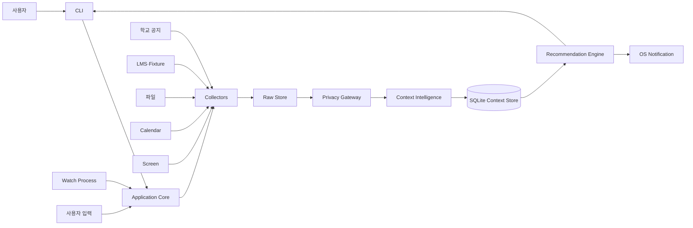

# 시스템 구조

## 1. 구조 원칙

- CLI는 사용자 입출력만 담당한다.
- 수집기, Context Engine, 저장소는 CLI와 독립적으로 실행할 수 있어야 한다.
- `watch` 프로세스와 단발성 CLI 명령은 같은 코어 모듈을 사용한다.
- 외부 LLM 호출 전에는 Privacy Gateway를 통과한다.
- 각 단계의 입력과 출력을 로컬에 기록해 문제를 추적할 수 있게 한다.
- 수집기 하나가 실패해도 다른 수집기와 CLI 조회는 계속 작동한다.

## 2. 상위 구조



## 3. 런타임 구성

### 단발성 CLI

명령을 실행하고 결과를 출력한 뒤 종료한다.

```text
dododo sync
dododo today
dododo inbox
dododo ask "오늘 뭘 먼저 해야 해?"
```

### Watch Process

사용자가 실행해 둔 동안 다음을 반복한다.

```text
수집 스케줄 확인
→ 변경된 Source만 동기화
→ 새로운 RawItem 분석
→ Context 갱신
→ 알림 후보 계산
→ 정책을 통과한 알림 전송
```

Watch Process가 종료되면 자동 수집과 알림도 멈춘다. OS 서비스 등록은 MVP 이후 범위다.

## 4. 처리 파이프라인

```text
Source
→ RawItem
→ Fact
→ ContextItem
→ Relation / Evidence
→ Recommendation Candidate
→ Policy Filter
→ CLI 또는 Notification
```

### 수집

Collector는 원문과 출처 메타데이터를 RawItem으로 만든다. 이 단계에서는 공지가 사용자에게 필요한지 판단하지 않는다.

### 변경 감지

URL, LMS 항목 ID, 캘린더 UID, 파일 경로와 Content Hash를 이용해 신규·수정·중복을 구분한다.

### 정보 추출

LLM 또는 Parser가 제목, 날짜, 지원 자격, 요구사항과 근거 문장을 Fact로 추출한다. 출력 형식이 검증되지 않으면 저장하지 않는다.

### 분류

Fact의 성격과 출처를 이용해 Opportunity, Task, Event, Note, Activity를 만든다.

### 병합과 충돌 해결

기존 ContextItem과 같은 대상인지 확인한다. 같은 대상이면 새 항목을 만들지 않고 변경 이력과 Evidence를 추가한다.

### 추천

일반 코드가 후보와 점수를 계산하고, LLM은 필요할 때 설명과 문장을 생성한다.

## 5. 권장 저장소 구조

```text
dododo/
├── apps/
│   └── cli/
│       ├── commands/             # setup, sync, watch, today, ask 등
│       ├── output/               # 표와 상세 출력
│       └── prompts/              # y/N/edit 확인 입력
├── packages/
│   ├── shared/
│   │   ├── schemas/
│   │   └── policies/
│   ├── collectors/
│   │   ├── school-notice/
│   │   ├── lms/
│   │   ├── files/
│   │   ├── calendar/
│   │   └── screen/
│   ├── context-engine/
│   │   ├── extraction/
│   │   ├── classification/
│   │   ├── resolution/
│   │   ├── conflicts/
│   │   ├── relevance/
│   │   ├── priority/
│   │   ├── advisor/
│   │   └── conversation/
│   ├── profile/
│   ├── scheduler/
│   ├── storage/
│   ├── privacy/
│   └── evaluation/
├── fixtures/
├── docs/
└── tests/
```

## 6. 팀 경계

### Desktop Runtime & CLI

- CLI 명령과 출력
- Watch Process
- 화면 캡처
- OS 알림
- 실행·중지와 권한 상태

### Data Ingestion & Storage

- 학교 공지와 LMS Collector
- 파일과 Calendar Parser
- Hash 기반 변경 감지
- SQLite와 변경 이력
- Source 장애 격리

### Context Intelligence & Recommendation

- Fact와 ContextItem 정의
- LLM 추출 정책
- 관련도·우선순위·병합·충돌 정책
- 화면 Activity 연결과 조언
- 대화 의도와 확인 정책
- Ground Truth와 Benchmark

